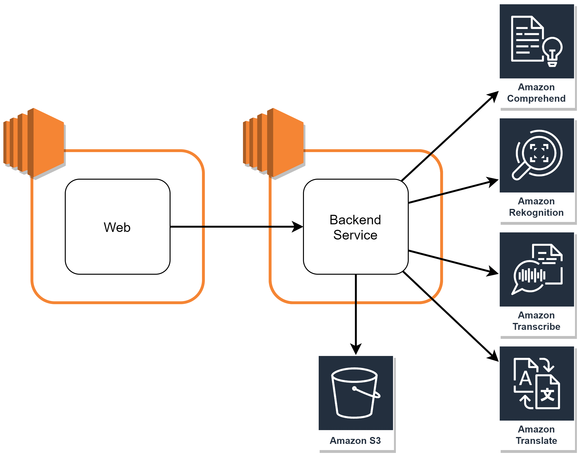

# Meeting AI

### Group members
Watcharit Tuntayakul	6031054721
Sumet Chorthongdee 	6031058221
Itthithee Leelachutipong	6031062721
Dolwijit Jiradilok		6031310321

------------

### Project Motivation
Due to COVID-19, the online meeting is held much more than the past. Sometimes, we are easily distracted by the environment or maybe you cannot attend the meeting. So, we present a web-app that lets you send the recorded video of the meeting, then it will make a summary of your meeting. This web can be useful during this social distancing policy and also on normal meetings to increase the performance of your meeting by analyzing your meeting to make it better and better next time.

### What Meeting AI can do?
- This version only supports English video recorded from zoom application
- Convert speech from video and create analysis text document
- Detect the emotions of attendees to measure the mood of the meeting
- List the entities from the meeting conversation to tell the roughly topic of the meeting
- Translate the meeting conversation from English to Thai and Japanese

------------

### Solution
#### Software components (Services used)
- **Amazon Transcribe**  
Price(Singapore region): 0.00040 ~ 0.00018 / minute  
Free tier: 60 minutes/month  
Usage: Convert speech to text  
Limit:  
&nbsp;&nbsp;&nbsp;Maximum audio file length: 4 hours /14,400 seconds  
&nbsp;&nbsp;&nbsp;Minimum audio file duration: 500 in milliseconds

- **Amazon Translate**  
Price: $15.00 per million characters  
Free tier: 2 million characters per month  
Usage: Translate to other languages, [support 71 languages](https://docs.aws.amazon.com/translate/latest/dg/what-is.html#language-pairs "support 71 languages")  
Limit:  
&nbsp;&nbsp;&nbsp;UTF-8 encoding, maximum 1,000,000 characters

- **Amazon Rekognition**  
Price (Singapore region): 0.00125 USD ~ 0.0005 USD / image  
Free tier: 5000 images / month  
Usage: Emotion detection

- **Amazon Comprehend**  
Price: 0.0001 USD ~ 0.000025 USD / unit (100 characters) for Entity Recognition task  
Free tier: 50,000 unit (5,000,000 characters)  
Usage: Detect entities from the meeting conversation  
Limit:  
&nbsp;&nbsp;&nbsp;UTF-8 encoding, minimum 1 byte, maximum 1 MB

- **Amazon S3**  
Store video and snapshots

- **Amazon EC2**  
VM for deploying web application for frontend and deploying server for backend

#### Architecture

#### How it works
1. Users upload a zoom video.
2. Server stores the video on S3.
3. The server creates snapshots from the video using FFMPEG about 10 seconds per 1 snapshot.
4. The server stores created snapshots on S3.
5. The server requests to create the transcription on the Transcribe and detect emotion on the Rekognition using S3 URIs.
6. The server returns the Rekognition results to the web application.
7. The web application redirects to the result page.
8. The web application polling the server to request the Transcribe every 2 seconds.
9. After the Transcribe has finished the transcription, the server sends the transcription's text to the Translate and the Comprehend services and waits for the results.
10. The server returns the Transcribe, the Translate and the Comprehend results to the web application, then the web application stops polling.
11. The web application updates the result page with the Transcribe, the Translate and the Comprehend results.

------------

### How to deploy the source code
#### Backend
1. Setup an IAM role  
[IAM Role Tutorial by Amazon](https://aws.amazon.com/th/premiumsupport/knowledge-center/create-new-iam-user/ "IAM Role Tutorial by Amazon")  
Assign full-access policy for AWS S3, AWS Rekognition, AWS Transcribe, AWS Translate and AWS Comprehend.  
After that, you will get AWS credentials.

2. Create an S3 bucket  
[AWS S3 by Amazon](https://docs.aws.amazon.com/AmazonS3/latest/userguide/GetStartedWithS3.html "AWS S3 by Amazon")  
(noted that S3, Rekognition and Transcribe should be in the same region and use the same IAM)

3. Create an EC2 instance  
[EC2 Tutorial by Amazon](https://docs.aws.amazon.com/AWSEC2/latest/UserGuide/EC2_GetStarted.html "EC2 Tutorial by Amazon")  
In the security group, open port 10000 for any connection for accessing the server from the web application.

4. Install git  
`sudo yum install git`

5. Install nvm and node  
`curl -o- https://raw.githubusercontent.com/nvm-sh/nvm/v0.34.0/install.sh | bash`  
`~/.nvm/nvm.sh`  
`nvm install node`

6. Install pm2  
`npm install pm2 -g`

7. Download the source code  
`git clone https://github.com/dolwijit13/meeting-ai.git`

8. Select the backend folder and set up environment by:  
`cd meeting-ai/backend`  
`cp example.env .env`  
`nano .env`  
Fill the .env file with:  
AWS credentials:  
&nbsp;&nbsp;&nbsp;`AWS_{service}_ID` from the IAM role  
&nbsp;&nbsp;&nbsp;`AWS_{service}_SECRET` from the IAM role  
&nbsp;&nbsp;&nbsp;`AWS_{service}_REGION` is the region of the service (region code)  
`AWS_REKOGNITION_BUCKET` is the S3 bucket name  
`PORT`=10000  
(noted that Rekognition and Transcribe credentials and region should be the same IAM)

9. Run following command to start the server with pm2  
`npm install`  
`pm2 start npm --name "meeting-ai-backend" -- start`

10. The server will be ready on public IPv4 of this EC2 instance on port 10000

11. If you want to stop deploying this service, run the following command:  
`pm2 list`  
to find id of that service and then run the following command:  
`pm2 delete {id}`

#### Frontend
1. Create an EC2 instance  
[EC2 Tutorial by Amazon](https://docs.aws.amazon.com/AWSEC2/latest/UserGuide/EC2_GetStarted.html "EC2 Tutorial by Amazon")  
In the security group, open port 3000 for any connection for accessing the web from the internet.

2. Install git, node  
`sudo yum install git node`

3. Install nvm and node version 14.16.1  
`curl -o- https://raw.githubusercontent.com/nvm-sh/nvm/v0.34.0/install.sh | bash`  
`~/.nvm/nvm.sh`  
`nvm install 14.16.1`

4. Install pm2  
`npm install pm2 -g`

5. Download the source code  
`git clone https://github.com/dolwijit13/meeting-ai.git`

6. Select the node version to 14.16.1 by using following command:  
`nvm use 14.16.1`

7. Select the frontend folder and set up environment by:  
`cd meeting-ai/frontend`  
`cp example.env .env`  
`nano .env`  
Add YOUR_BACKEND_IP_ADDRESS which is the public IPv4 of backends EC2 instance in the .env:  
`REACT_APP_BACKEND={YOUR_BACKEND_IP_ADDRESS:10000}`

8. Run the following command to start the server with pm2  
`npm install`  
`pm2 start npm --name "meeting-ai-frontend" -- start`

9. The web will be ready on public IPv4 of this EC2 instance on port 3000

10. If you want to stop deploying this service, run the following command:  
`pm2 list`  
to find id of that service and then run the following command:  
`pm2 delete {id}`
